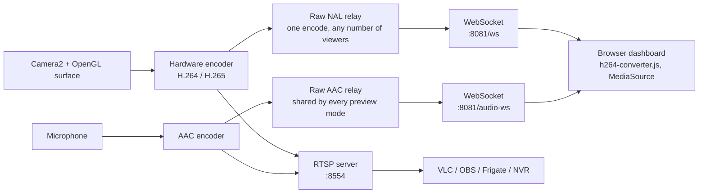

<div align="center">


# RTSP CCTV App

**Turn any spare Android phone into a real security camera.**

Runs an RTSP server and a web dashboard on your device, and streams to VLC, OBS, Frigate,
Home Assistant or any NVR — no cloud, no account, no subscription.

[](https://github.com/Zektopic/RSTP-CCTV-App/actions/workflows/ci.yml)
[](https://github.com/Zektopic/RSTP-CCTV-App/releases)
[](https://developer.android.com/about/versions/nougat)
[](https://developer.android.com/about/versions/16)
[](https://kotlinlang.org)
[](LICENSE)

</div>

---

## Contents

- [Why](#why)
- [Features](#features)
- [How it works](#how-it-works)
- [Quick start](#quick-start)
- [Connecting a client](#connecting-a-client)
- [Security](#security)
- [HTTP API](#http-api)
- [Permissions](#permissions)
- [Building from source](#building-from-source)
- [Troubleshooting](#troubleshooting)
- [Roadmap](#roadmap)
- [Contributing](#contributing)
- [License](#license)

---

## Why

An old phone already has everything a security camera needs: a decent sensor, a
hardware H.264/H.265 encoder, Wi-Fi, a battery that doubles as a UPS, and a torch for
night use. This app turns that hardware into a standards-compliant RTSP source that any
NVR can consume, and keeps every frame on your own network.

---

## Features

### Streaming
- **RTSP server** on port `8554`, low latency over Wi-Fi
- **Hardware-accelerated codecs** — H.264, H.265 (HEVC), with automatic fallback to
  H.264 when the selected codec cannot be prepared
- **Resolutions** from 640×480 up to the camera's maximum (capped at 4K to stay within
  encoder limits)
- **Bitrate** adjustable via slider (500–8000 kbps), live while streaming, in both the
  app and the web dashboard
- **Frame rate** selectable (5–30 fps) in both the app and the web dashboard
- **Microphone audio** included in the stream whenever the RECORD_AUDIO permission is
  granted
- **Background operation** via a foreground service; keeps streaming with the screen off
- **Front/back camera switching**, from the app, the dashboard, or the API

### Monitoring
- **Web dashboard** on port `8081` — live preview, every setting, battery and Wi-Fi status

### Overlays and camera control
- Timestamp overlay (always on) with an optional battery/CPU temperature readout,
  positionable in any corner, three text sizes
- Torch control, plus a **night mode** that switches the torch on automatically using the
  ambient light sensor
- Digital zoom control via slider, in both the app and the web dashboard

---

## How it works



Everything runs inside one foreground service. The RTSP stream comes straight off the
hardware encoders; the dashboard's live preview forwards those same encoders' raw H.264 NALs
(no server-side muxing) to every connected browser tab over one WebSocket each, sharing one
camera capture rather than opening it once per viewer. Each tab builds the fragmented MP4
client-side and feeds a `<video>` via Media Source Extensions, through `h264-converter.js`
(vendored, the same library ws-scrcpy's web client uses). The self-healing playback logic
(GOP-based buffer trimming, per-frame stall detection/recovery -- a port of ws-scrcpy's own
`MsePlayer.ts`/`BasePlayer.ts`) lives in `mse-preview.js`; everything else on the dashboard
page (zoom, settings, status polling) is `dashboard.js`.

Audio is a separate, shared preview independent of which video transport (MSE or WebRTC) is
active: RootEncoder's mic capture runs continuously regardless, so one raw-PCM relay over its
own WebSocket serves every dashboard tab no matter which video mode it's showing. The browser
schedules it directly with the Web Audio API (`AudioBufferSourceNode.start(time)`), no decode
step at all -- MediaSource/SourceBuffer fed AAC, and separately the WebCodecs `AudioDecoder`
API, were both tried and reverted (the former has no live-edge tracking of its own once audio
isn't riding along inside a video preview's own self-healing anymore, so latency just
accumulates forever; the latter is unavailable in some browsers, e.g. Firefox). Raw PCM's
bandwidth cost (8x AAC's, at this app's bitrate) is trivial next to the video already on the
same LAN connection.

| Component | File |
|---|---|
| Foreground service, camera, stream lifecycle | `CctvServerService.kt` |
| HTTP server, dashboard and WebSocket routes | `WebServer.kt` |
| Camera pipeline shared by RTSP/recording/MSE/WebRTC | `SharedCameraStream.kt` |
| Per-viewer MSE video broadcast (raw NAL relay) and WebSocket handling | `MseVideoBridge.kt`, `MseStreamSocket.kt` |
| Shared audio broadcast (raw PCM relay), independent of video transport | `AudioStreamBridge.kt`, `AudioStreamSocket.kt` |
| MSE client: video fmp4 muxing (vendored), self-healing playback, dashboard UI | `h264-converter.js`, `mse-preview.js`, `dashboard.js` |
| Shared audio playback: direct Web Audio API scheduling, no decode step | `audio-preview.js` |
| Authentication, CSRF and HTML escaping | `WebAuth.kt` |
| Settings | `AppPreferences.kt` |

---

## Quick start

1. **Install** the APK from [Releases](https://github.com/Zektopic/RSTP-CCTV-App/releases),
   or [build it yourself](#building-from-source).
2. **Grant permissions** on first launch — Camera is required. Notifications and
   Microphone are optional.
3. **Note the generated dashboard password.** On first run the app creates a random
   password for the web dashboard and shows it to you once. It is also visible any time
   under *Authentication*.
4. **Configure** resolution, codec and any overlays you want.
5. **Toggle the server on.** The app shows the RTSP and dashboard URLs.
6. **Connect** from any client on the same network.

> [!TIP]
> Leave the phone plugged in. Encoding video continuously is a heavy, sustained load and
> will drain a battery in a few hours.

---

## Connecting a client

```
rtsp://<phone-ip>:8554/stream                 # no authentication
rtsp://<user>:<pass>@<phone-ip>:8554/stream   # with authentication enabled
```

| Client | How |
|---|---|
| **VLC** | Media → Open Network Stream → paste the RTSP URL |
| **ffplay** | `ffplay -fflags nobuffer rtsp://<phone-ip>:8554/stream` |
| **OBS** | Add a *Media Source*, uncheck *Local File*, paste the URL |
| **Home Assistant** | Generic Camera integration, or `go2rtc` |
| **Frigate** | Add as an `ffmpeg` input under `cameras:` |

The web dashboard lives at `http://<phone-ip>:8081`.

---

## Security

This app puts a camera on your network. The defaults are chosen accordingly.

### What is protected

| Control | Default | Notes |
|---|---|---|
| Web dashboard authentication | **On** | HTTP Basic. A strong password is generated on first run. |
| RTSP authentication | Off | Enable under *Authentication*; applies to the RTSP stream. |
| Cross-origin requests | **Rejected** | Stops a website you visit from driving the camera over your LAN. |
| Credentials in cloud backup | **Excluded** | Preferences and snapshots are excluded from Auto Backup and device transfer. |
| Start when app opens | **Off** | Opt-in. Opening the app no longer starts streaming by itself. |

### What you should still do

> [!IMPORTANT]
> - **Never port-forward this app to the internet.** Both servers speak plaintext — RTSP
>   and HTTP, no TLS. Use a VPN (WireGuard, Tailscale) to reach it from outside.
> - **Keep dashboard authentication on** unless you are on a network you fully trust.
>   With it off, anyone who can reach port 8081 can watch the camera and change settings.
> - **Use a dedicated IoT VLAN or guest network** if your router supports it.

### Signing key rotation

> [!WARNING]
> The release signing key used before version 1.1.0 was committed to this public
> repository and **must be considered compromised**. It has been removed and replaced.
>
> **If you installed a release built before 1.1.0, you must uninstall it before
> installing a newer one.** Android refuses to update an app across a change of signing
> key, so the install will otherwise fail with a signature mismatch. Your settings will
> be lost; the RTSP and dashboard passwords need to be set again.

### Reporting a vulnerability

Please open a [security advisory](https://github.com/Zektopic/RSTP-CCTV-App/security/advisories/new)
rather than a public issue.

---

## HTTP API

Base URL `http://<phone-ip>:8081`.

**Authentication.** When the dashboard is secured (the default), every endpoint requires
HTTP Basic credentials and returns `401` with a `WWW-Authenticate` header otherwise.

```bash
curl -u admin:<password> http://192.168.1.50:8081/status
```

**Verbs.** State-changing endpoints accept `POST` (preferred) and `GET` (kept for
compatibility with existing scripts and NVR integrations). Requests carrying a
cross-origin `Origin` header are rejected with `403`.

### Read

| Endpoint | Returns |
|---|---|
| `GET /` | The dashboard |
| `GET /status` | JSON status: streaming state, codec, resolution, every setting, battery, Wi-Fi |
| `GET /recordings` | HTML page listing saved recordings, newest first |
| `GET /recording.mp4?id=<id>[&download=1]` | Streams a recording inline, or forces download with `download=1` |

### Write

| Endpoint | Parameters |
|---|---|
| `POST /action/toggle-stream` | — |
| `POST /action/switch-camera` | — |
| `POST /action/set-codec` | `codec=H264\|H265` |
| `POST /action/set-resolution` | `w=<int>&h=<int>` |
| `POST /action/set-setting` | `key=<key>&value=<value>` |
| `POST /action/set-auth` | `enabled=<bool>&username=<s>&password=<s>` |

### Live preview (MSE)

The dashboard's live preview is MSE (Media Source Extensions), not a plain HTTP endpoint:
`WS /ws` streams raw H.264, video only (subject to the same Origin/Basic-Auth checks as
every route above, checked once against the WebSocket upgrade request's headers). One
browser tab opens one `/ws` connection; every connection is fed from the same encoder
output -- any number of tabs can watch at once without a second hardware encode. There's no
SDP/ICE negotiation: the socket is send-only from the phone's side, so it only works between
devices that can reach each other directly (this app is LAN-only by design, see "Security"
above). Requires the H264 codec -- switching to H265 closes every connected viewer, since
the client can't decode it.

The server does no container work at all; each tab's own client-side code builds the
fragmented MP4 itself via `h264-converter.js` (vendored, the same library ws-scrcpy's web
client uses). The wire format is one text frame, then binary frames:

```jsonc
// Phone -> browser, once on connect.
{"fps": 30}
```
```
// Phone -> browser, binary WebSocket frames -- each one a raw Annex-B H.264 NAL (start code
// included), straight off the video encoder. The first one (sent right after the control
// message above) is SPS + PPS concatenated.
```

Every new viewer is gated: NALs are dropped until a real IDR keyframe arrives (the client's
muxer treats whatever it's given first as the keyframe, whether or not it actually is, so a
non-IDR NAL first would build a broken init segment). A frame rate or SPS change closes
every connected `/ws` viewer (a fresh `VideoConverter` only picks up the first config it's
ever given) -- the dashboard reconnects automatically and starts a new one.

If the camera isn't currently streaming, the server closes the socket immediately
(`GoingAway`) rather than accepting an offer it has nothing to answer with -- see
`app/src/main/assets/web/mse-preview.js`, which just reconnects on a timer.

### Shared audio preview

Audio is a separate WebSocket, `WS /audio-ws`, shared by both the MSE and WebRTC video
previews -- it doesn't care which one is active, or whether either is even connected.
Available whenever a microphone is present (`RECORD_AUDIO` granted); if not, or before the
mic has produced its first frame, the server closes the socket immediately (`GoingAway`) the
same way `/ws` does pre-stream. Same send-only, LAN-only, no-SDP/ICE design as `/ws`; the wire
format is one text frame, then binary frames:

```jsonc
// Phone -> browser, once on connect. Fixed for this app's lifetime -- see
// CctvServerService.kt's `stream.prepareAudio(sampleRate = 16000, isStereo = false, ...)`.
{"sampleRate": 16000, "channelCount": 1}
```
```
// Phone -> browser, binary WebSocket frames -- each one a raw 16-bit PCM chunk, straight off
// the microphone. No encoding, no container.
```

The browser schedules these directly with the Web Audio API (`audio-preview.js`,
`AudioBufferSourceNode.start(time)`) -- no decode step, no MediaSource/SourceBuffer. Each
chunk is scheduled at `max(<next queued time>, <audio clock now>)`, which is what keeps
playback latency from silently accumulating the way a buffered approach (MediaSource, tried
first) would.

<details>
<summary><b>Keys accepted by <code>/action/set-setting</code></b></summary>

| Key | Type | Meaning |
|---|---|---|
| `show_system_info` | bool | System info (battery %/temp, CPU temp) in the overlay; the clock itself always shows |
| `overlay_position` | `Top Left` \| `Top Right` \| `Bottom Left` \| `Bottom Right` | Overlay corner |
| `overlay_size` | `Small` \| `Medium` \| `Large` | Overlay text size |
| `flashlight_enabled` | bool | Torch |
| `auto_focus_enabled` | bool | Continuous auto focus (off locks focus at its current position) |
| `night_mode_enabled` | bool | Automatic torch by ambient light |
| `vertical_flip_enabled` | bool | Flip stream/preview for an upside-down mount |
| `zoom_level` | float 1.0–8.0 | Camera digital zoom factor |
| `bitrate_kbps` | int 500–8000 | Video bitrate, applied live while streaming |
| `video_fps` | int 5–30 | Video frame rate; changing it restarts the stream |
| `web_auth_enabled` | bool | Require authentication on port 8081 |
| `record_to_gallery_enabled` | bool | Record rotating segments to the app's private storage, browsable via `/recordings` |
| `record_segment_minutes` | int 1–60 | Length of each recorded segment |
| `record_storage_threshold_percent` | int 10–90 | Local storage usage above which the oldest recorded segments are deleted |

</details>

---

## Permissions

| Permission | Required | Why |
|---|---|---|
| `CAMERA` | **Yes** | Capturing video. Without it the server will not start. |
| `REQUEST_IGNORE_BATTERY_OPTIMIZATIONS` | **Yes** | Starting the server also asks to be exempted from battery optimization — without it, OEM battery management is free to kill the camera in the background. |
| `INTERNET`, `ACCESS_NETWORK_STATE` | Yes | Running the local RTSP and HTTP servers, and reporting the device IP. |
| `FOREGROUND_SERVICE`, `FOREGROUND_SERVICE_CAMERA` | Yes | Long-running capture. |
| `RECORD_AUDIO`, `FOREGROUND_SERVICE_MICROPHONE` | Yes | Microphone audio is always included in the stream when granted; falls back to camera-only if denied. |
| `POST_NOTIFICATIONS` | Recommended | Android 13+. Without it the service notification is suppressed and you lose the visible indicator that the camera is live. |
| `ACCESS_WIFI_STATE`, `ACCESS_FINE_LOCATION` | Optional | Wi-Fi signal readout on the dashboard. Android 8.1+ hands back a placeholder RSSI (so the dashboard shows no signal) unless the app has location permission *and* the device's system location toggle is on. |

No internet permission is used to send data anywhere. Nothing leaves your network. Recorded
segments are written to the app's own private storage (not the shared gallery/`MediaStore`),
so no storage permission is needed on any Android version, and recordings are wiped
automatically when the app is uninstalled.

---

## Building from source

**Requirements:** JDK 21, Android SDK with API 36, Android Studio (Ladybug or newer) or
the command line.

```bash
git clone https://github.com/Zektopic/RSTP-CCTV-App.git
cd RSTP-CCTV-App

./gradlew testDebugUnitTest    # 32 unit tests
./gradlew lintDebug
./gradlew assembleDebug        # app/build/outputs/apk/debug/
```

### Building a signed release

The release keystore is **not** in this repository and never will be. Provide credentials
one of two ways.

**Locally** — create `keystore.properties` in the repository root (it is git-ignored):

```properties
storeFile=/absolute/path/to/release.jks
storePassword=...
keyAlias=release
keyPassword=...
```

**In CI** — set these repository secrets:

| Secret | Contents |
|---|---|
| `RELEASE_KEYSTORE_BASE64` | `base64 -w0 release.jks` |
| `RELEASE_KEYSTORE_PASSWORD` | Keystore password |
| `RELEASE_KEY_ALIAS` | Key alias |
| `RELEASE_KEY_PASSWORD` | Key password |

Without credentials the release build still succeeds and produces
`app-release-unsigned.apk`, so forks and pull requests are never blocked on secrets.

Releases are published by pushing a `v*` tag or running the *Android Release* workflow
manually — not on every commit to `master`.

> [!NOTE]
> Dependency versions are pinned in `gradle/libs.versions.toml`. Do not reintroduce
> `master-SNAPSHOT` coordinates: a moving snapshot previously upgraded RootEncoder
> underneath the project and broke a build whose CI had already passed.

---

## Troubleshooting

<details>
<summary><b>The server will not start</b></summary>

Check that the Camera permission is granted.
</details>

<details>
<summary><b>The stream is black, or the client cannot connect</b></summary>

- Confirm the phone and the client are on the same network and the network is not using
  AP isolation (common on guest Wi-Fi).
- Try 640×480 with H.264 first — some devices cannot prepare H.265 at high
  resolutions, and the app falls back to H.264 when preparation fails.
- Check the notification is present; if it is gone, the OS killed the service.
</details>

<details>
<summary><b>The dashboard asks for a password I do not have</b></summary>

Open the app and look under *Authentication* — the generated username and password are
shown there. You can also turn *Secure Web Dashboard* off, though that leaves the camera
open to everyone on the network.
</details>

<details>
<summary><b>Streaming stops when the screen turns off</b></summary>

Toggling the server on already prompts you to exempt the app from battery optimization —
make sure you accepted that dialog. Some OEMs (worst on Xiaomi/MIUI, Huawei, Oppo and
Samsung) still kill the camera in the background regardless; on Xiaomi also enable
*Autostart*. See [dontkillmyapp.com](https://dontkillmyapp.com) for per-vendor steps.
</details>

---

## Roadmap

- [ ] HTTPS/TLS for the dashboard, so credentials are not sent in plaintext
- [x] Enable R8 for release builds
- [ ] ONVIF discovery so NVRs can find the camera automatically
- [ ] Continuous recording with a rolling buffer
- [ ] Multi-camera management from one dashboard

---

## Contributing

Issues and pull requests are welcome.

- Run `./gradlew testDebugUnitTest lintDebug` before opening a PR — CI runs both.
- Add tests for logic that can be tested on the JVM. Keeping such logic free of Android
  imports (as in `WebAuth`) is deliberate.
- Never commit keystores, passwords or `keystore.properties`.

---

## License

Released under the [MIT License](LICENSE) — you may use, modify and redistribute this
software, including commercially, provided the copyright notice and licence text are
retained.

The bundled dependencies listed below are Apache-2.0 licensed and remain under their own
terms.

### Built with

- [RootEncoder](https://github.com/pedroSG94/RootEncoder) and
  [RTSP-Server](https://github.com/pedroSG94/RTSP-Server) by pedroSG94
- [NanoHTTPD](https://github.com/NanoHttpd/nanohttpd)
